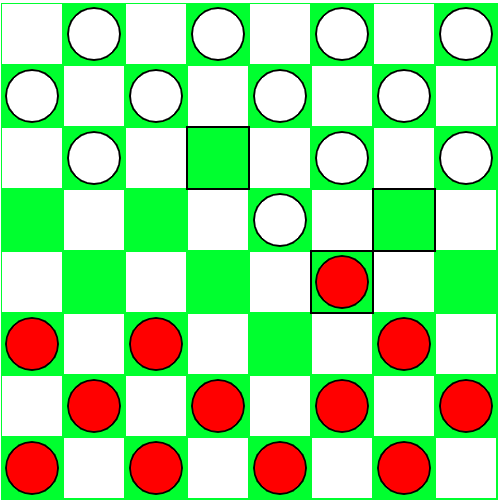

# CHECKERS
#### Work in progress
Recently, I started learning some artificial intelligence. I learnt about games and adversarial search and decided to put what I have learnt to practice to get a better understanding of all the concepts. Initially, I built a simple console text-based TIC-TAC-TOE AI which was a success. I decided to do something more complex and that's what gave birth to this project.  

I decided to implement the most popular [English checkers](https://en.wikipedia.org/wiki/English_draughts) because I felt it was going to be easier because of its constraints. This is a snapshot of my progress so far: 

So far I have been able to implemented a basic checkers engine. Red plays first. To be honest, before I started I thought it was going to be straight forward and simple but I got disappointed because it really wasn't. The process has been fun so far and I've learnt a lot from just what I have been able to build. 

### TODO
- Forced Captures
- Promotion of man to king
- Start building the AI
- Clean up the code
- Show feedback to enhance user experience

Visit [https://amosaidoo.com/checkers/](https://amosaidoo.com/checkers/) to view the project.

